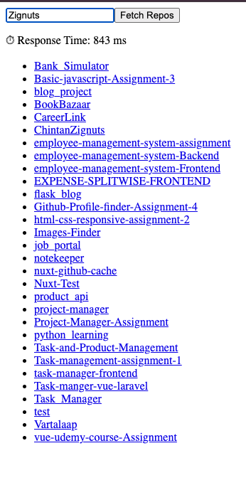
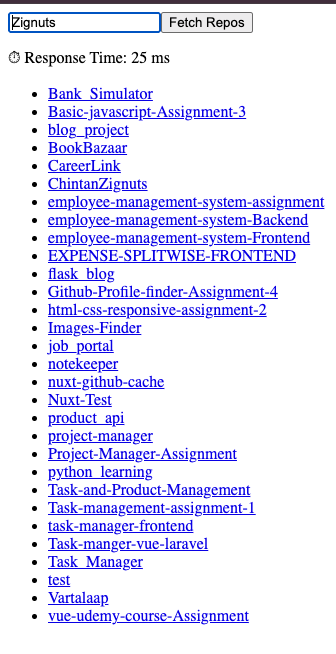

# ⚡ Nuxt 3 GitHub Repo Fetcher with Server-side Caching

This project demonstrates how to use Nuxt 3’s Nitro server-side caching (via defineCachedEventHandler) to fetch data from the GitHub API and deliver faster response times for repeated requests.

✨ Features
• Uses defineCachedEventHandler with maxAge and stale-while-revalidate (SWR)
• Caches GitHub API responses server-side for 60 seconds
• Includes client-side measurement of real fetch time using performance.now()
• Demonstrates browser caching (304 Not Modified, disk cache) vs. server cache

🚀 Tech Stack
• Nuxt 3
• Nitro Server API
• ofetch
• GitHub REST API

## Setup

Make sure to install dependencies:

```bash
# npm
npm install

# pnpm
pnpm install

# yarn
yarn install

# bun
bun install
```

## Development Server

Start the development server on `http://localhost:3000`:

```bash
# npm
npm run dev

# pnpm
pnpm dev

# yarn
yarn dev

# bun
bun run dev
```

## Production

Build the application for production:

```bash
# npm
npm run build

# pnpm
pnpm build

# yarn
yarn build

# bun
bun run build
```

Locally preview production build:

```bash
# npm
npm run preview

# pnpm
pnpm preview

# yarn
yarn preview

# bun
bun run preview
```

Check out the [deployment documentation](https://nuxt.com/docs/getting-started/deployment) for more information.

🖼 Screenshots

📸 1st Request (No Cache)
• Full GitHub API fetch
• 200 OK
• Slowest response (~500ms+)


📸 2nd Request (From Nitro Cache)
• Cached by defineCachedEventHandler
• Still returns 200 OK
• Much faster (~30–100ms)


## 📚 Resources

- Nuxt 3 Server API: https://nuxt.com/docs/getting-started/server
- nitro defineCachedEventHandler: https://nitro.build/guide/cache
- GitHub REST API: https://docs.github.com/en/rest/repos/repos#list-repositories-for-a-user
- MDN Cache-Control: https://developer.mozilla.org/en-US/docs/Web/HTTP/Headers/Cache-Control
- ofetch (Nuxt’s fetch): https://github.com/unjs/ofetch
